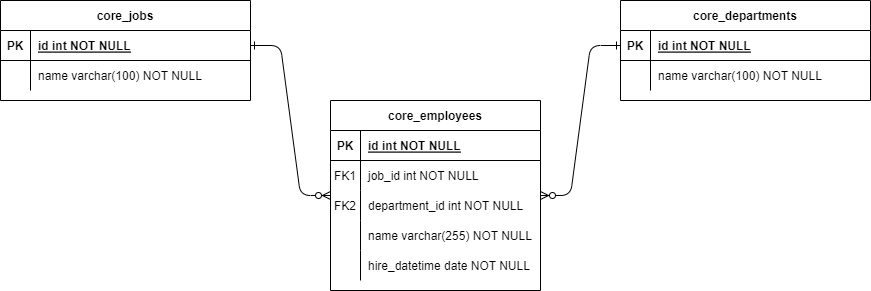
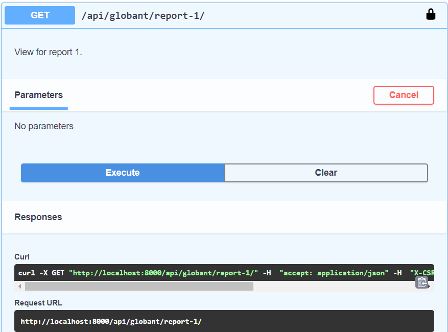
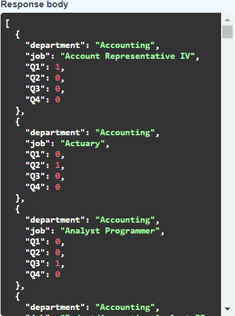
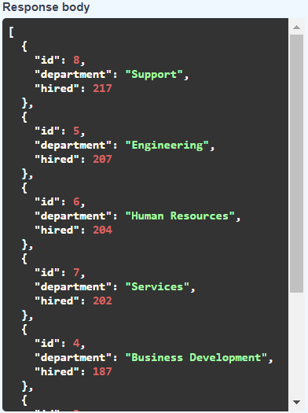

# Data Engineering Coding Challenge

This repository contains my solution for the coding challenge presented during the recruitment process. It includes my implementation to address the challenges and requirements provided as part of the evaluation.

## Architecture

The REST API is developed with the following tech stack:

- Python (3.9-alpine3.13) - Backend programming language.
- Django (3.2.4) - Web development framework in Python.
- djangorestframework (3.12.4) - Library used in Django to build Rest APIs.
- drf-spectacular (0.15.1) - OpenAPI 3 schema generation library for documentation of APIs.
- PostgreSQL (13-alpine) - Database for the application.
- flake8 - Tool that checks Python code for style and syntax errors.
- Pandas (2.2.2) - Python library to process data.
- Github Actions - CI/CD to run deployments and unit tests.


## Database

The entity-relationship model is the following:



## API

### Section 1: Database Migration

This API is intended for uploading CSV files to populate the database. The tables include core_jobs, core_departments, and core_employees. Integrity checks are implemented, particularly in the core_employees table, where employees with invalid or missing values are not inserted.

#### Upload CSV files

| Request          | Response         |
| ---------------- | ---------------- |
|  |  |

### Section 2: SQL reports

This API facilitates the exploration of data previously inserted. As a business requirement, there should be an endpoint for each report.

#### Report 1

| Request          | Response         |
| ---------------- | ---------------- |
|  |  |

#### Report 2

| Request          | Response         |
| ---------------- | ---------------- |
|  |  |

## Local deployment of the REST API

Execute the following command To build the image:

```sh
docker-compose build
```

Execute the following command to run the services:

```sh
docker-compose up
```

Execute the following command to run database migrations:

```sh
docker-compose run --rm app sh -c "python manage.py wait_for_db && flake8"
docker-compose run --rm app sh -c "python manage.py migrate"
```

The API is available in the following URL:
```sh
http://localhost:8000/api/docs/
```


## Tests

Execute the following command to run the unit tests:

```sh
docker-compose run --rm app sh -c "python manage.py test"
```

